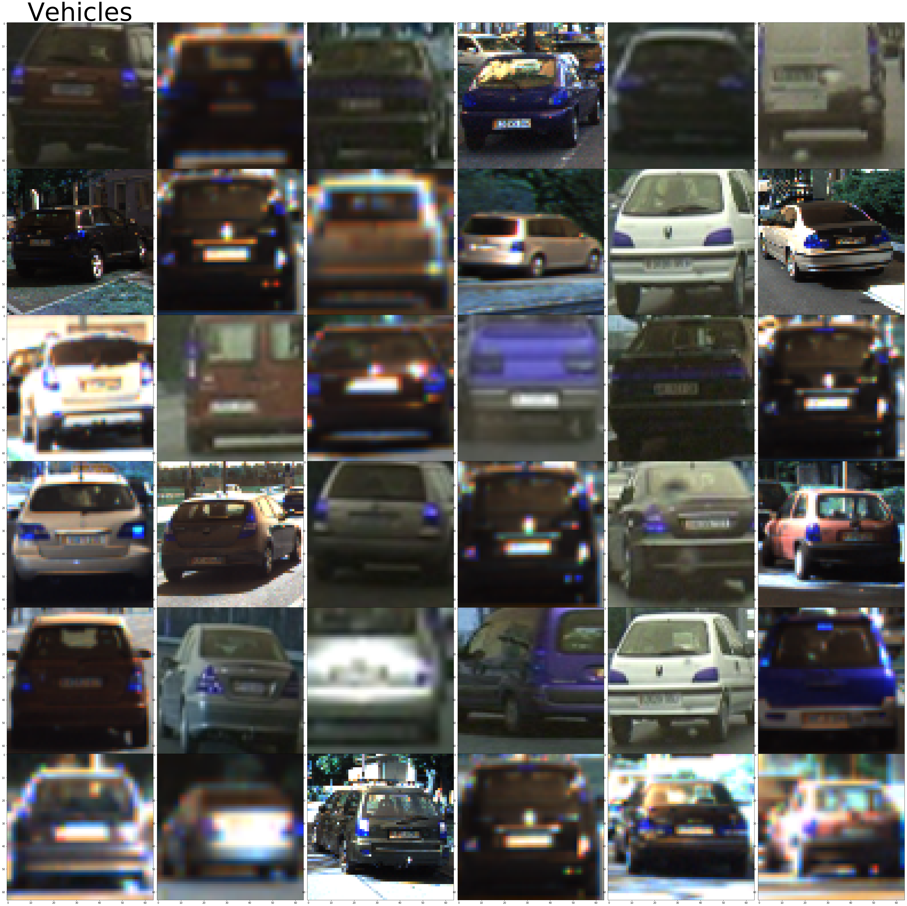
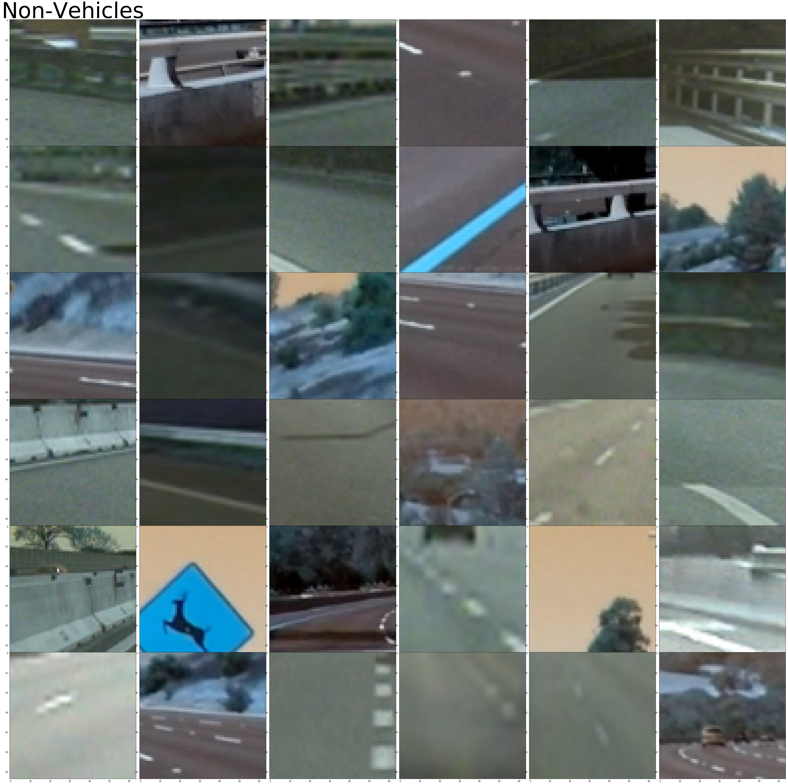
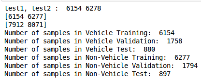
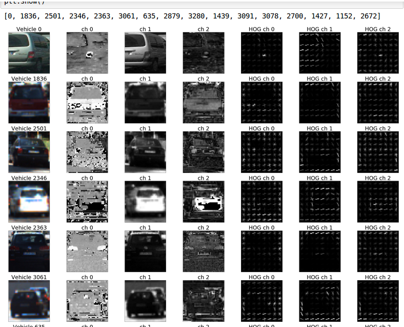
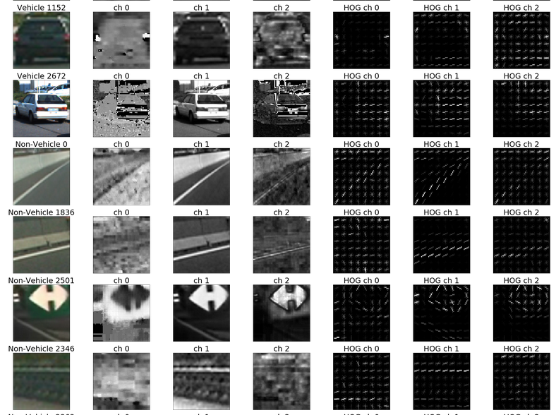
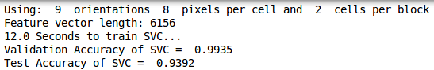
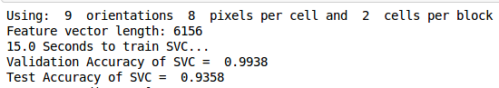
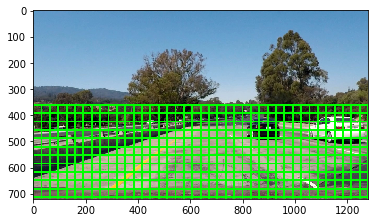

# Vehicle Detection

In this project, your goal is to write a software pipeline to detect vehicles in a video (start with the test_video.mp4 and later implement on full project_video.mp4), but the main output or product we want you to create is a detailed writeup of the project.  Check out the [writeup template](https://github.com/udacity/CarND-Vehicle-Detection/blob/master/writeup_template.md) for this project and use it as a starting point for creating your own writeup.  

The Project
---

The goals / steps of this project are the following:

* Perform a Histogram of Oriented Gradients (HOG) feature extraction on a labeled training set of images and train a classifier Linear SVM classifier
* Optionally, you can also apply a color transform and append binned color features, as well as histograms of color, to your HOG feature vector. 
* Note: for those first two steps don't forget to normalize your features and randomize a selection for training and testing.
* Implement a sliding-window technique and use your trained classifier to search for vehicles in images.
* Run your pipeline on a video stream (start with the test_video.mp4 and later implement on full project_video.mp4) and create a heat map of recurring detections frame by frame to reject outliers and follow detected vehicles.
* Estimate a bounding box for vehicles detected.

Here are links to the labeled data for [vehicle](https://s3.amazonaws.com/udacity-sdc/Vehicle_Tracking/vehicles.zip) and [non-vehicle](https://s3.amazonaws.com/udacity-sdc/Vehicle_Tracking/non-vehicles.zip) examples to train your classifier.  These example images come from a combination of the [GTI vehicle image database](http://www.gti.ssr.upm.es/data/Vehicle_database.html), the [KITTI vision benchmark suite](http://www.cvlibs.net/datasets/kitti/), and examples extracted from the project video itself.   You are welcome and encouraged to take advantage of the recently released [Udacity labeled dataset](https://github.com/udacity/self-driving-car/tree/master/annotations) to augment your training data.  

**As an optional challenge** Once you have a working pipeline for vehicle detection, add in your lane-finding algorithm from the last project to do simultaneous lane-finding and vehicle detection!

**If you're feeling ambitious** (also totally optional though), don't stop there!  We encourage you to go out and take video of your own, and show us how you would implement this project on a new video!

## How to start this project

1. First download above zipped vehicle and non-vehicle data.
2. Make directory name 'train'.
3. Extract each zip data.
4. Copy non-vehicles in non-vehicles.zip to train directory.
5. Copy vehicles in vehicles.zip to train directory.
6. Typing at your linux terminal like this: 'jupyter notebook doit.ipynb'

## Data Exploration

First, I referenced Udacity's Lecture 19(Data Exploration).
Then I can implement results like below.
This image means the Vehicles.

And next image means the Non-Vehicles.

After I'm making some samples of training, verifying, and testing.
I used 70% data for training, 20% data for verifying and 10% for testing.
So, the results looks like below.

These are all implements at doit.ipynb.

## HOG(Histogram of Oriented Gradients)

First, I referenced Udacity's Lecture 29(HOG Classify).
Above I mentioned 70% for training, 20% for verifying, and 10% for testing.
I implement it with np.random.randint().
So this dataset was shuffled!
I tried to various colorspace and I choice HLS.
I select orientations for '9', pixels_per_cell for '(8, 8)', and cells_per_block for '(2, 2)'.
Here is my Vehicle results using HLS Color Space and above HOG parameters.

And below is my Non-Vehicle results.

This part also exist at doit.ipynb.

## Why choice HLS and HOG parameter ?

I decide to remove RGB Color Space.
Because of most of prior project has illumination problem.
So, I have to remove this problem.
I can get good results at HSV, HLS like below.

And HLS looks like this.

They have also similar results.
So I think I can use these two(HSV, and HLS) all.
Anyway, I select HLS.
Because of Accuracy, so I select pixels_per_cell for (8, 8).
When I select (16, 16) then it has not so good Accuracy.
And cells_per_block is same reason.
That's the reason I select these values.

## SVM Based Classifier

I use SVM for training with 'svc = LinearSVC()'.
Training with 'svc.fit()' and predict with 'svc.predict()'.
I use all HLS three channels for reducing accuracy decrease.
However it still has problem that is same as fourth project(illumination).
It makes False Positive problem.
So, I'll remove it with Thresholding technique.
But, I also mentioned prior project, Thresholding technique is bad on illumination problem.
I'll modify it at future.

## Sliding Window

First, I referenced Udacity's Lecture 32(Sliding Window Implementation).
I can make below windows.

It makes big problem.
